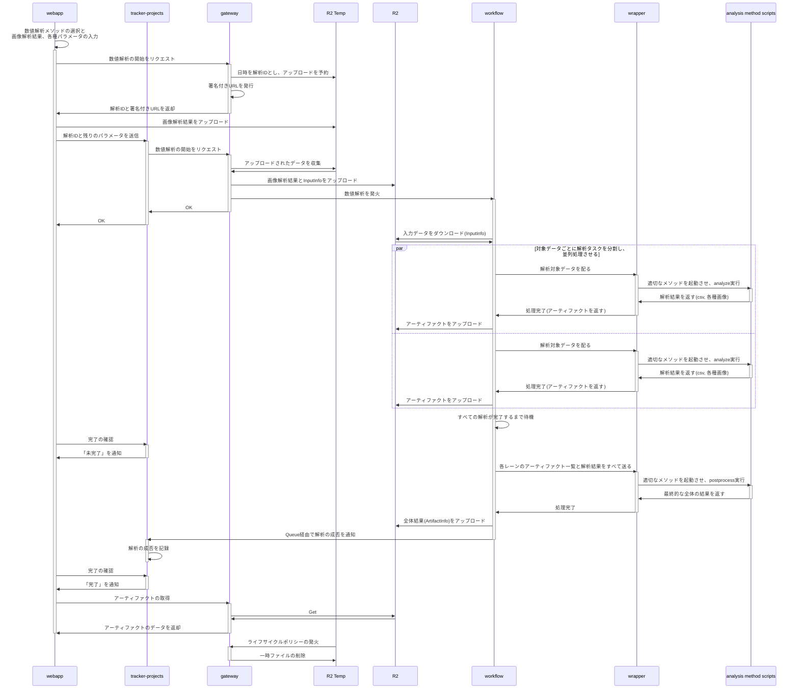

#prompt

# 分散環境/ローカル環境/Jupyter notebook環境の全てに対応するrunnerを実装する

## 各環境の概説
### 分散環境:
環境変数`ANALYSISRUN_METHOD`が指定されている場合、このモードで起動する。 
- 値が`analyze`の場合: 1レーンの解析のみを行い、その結果と画像データを返す
- 値が`postprocess`の場合: 全レーンの解析結果を受け取り、後処理を行なってその結果を返す

「画像解析結果全体のレーンごとの分割→レーンごとの解析の実行→後処理」の流れのオーケストレーションは別のアプリが担う。

入出力は後述する構造でtar形式でやり取りする。このモードで実行する場合には、標準出力に全て書き込んだ後には終了コード0でプロセスを終了する。

#### 分散環境の概要
以下のシーケンス図の`analysis`が、今回実装するrunnerを使用して実装されるPythonスクリプト。


### ローカル環境:
正確に表現すると「並列実行可能なローカル環境」。
解析するレーンごとにプロセスを割り当てて、並列で解析を実行する。

既存の`ParallelRunner`とは異なり、分散環境での実行時と同じように別プロセスにtarとしてパラメータを渡して解析処理を実行するようにする。
メインのプロセスは、解析処理の分配と全ての解析処理が完了した後のpostprocessを実行するオーケストレータとして振る舞う。

`manual_input`を指定しても良いし、指定がなければ自動的に`scan_model_input`を使用して対話的に入力データを入力させる。

最終的な解析結果をユーザーが保存したり追加の処理を加えるため、戻り値としてDataFrameを返す。

### Jupyter notebook環境:
ローカル上のJupyter notebook環境。
マルチプロセスでの解析実行ができない環境としてこの環境をとらえ、1レーンずつシーケンシャルに解析を実行する。

`manual_input`の指定が必須。

終的な解析結果をユーザーが保存したり追加の処理を加えるため、戻り値としてDataFrameを返す。

## 想定しているrunnerの使い方

```python
from typing import NamedTuple

import analysisrun as ar
from pydantic import BaseModel


class Parameters(BaseModel):
    """ユーザーが定義する任意の解析パラメータ"""
    param1: int
    param2: str


class ImageAnalysisResults(NamedTuple):
    """
    ユーザーが定義する、解析対象となる画像解析結果のセット
    
    入力となるcsvデータそれぞれがFieldsに変換され、解析で使用される。
    NamedTupleLikeプロトコルを実装している。
    """
    activity_spots: Fields = ar.ImageAnalysisResultSpec(
        description="輝点情報の画像解析結果csv",
        cleansing=entity_filter("Activity Spots")
    )
    surrounding_spots: Fields = ar.ImageAnalysisResultSpec(
        description="輝点の周辺情報の画像解析結果csv",
        cleansing=ar.entity_filter("Surrounding Spots")
    )


def analyze(args: ar.AnalyzeArgs[Parameters, ImageAnalysisResults])
    # 解析処理の実装
    pass

def postprocess(args: ar.PostprocessArgs[Parameters])
    # 後処理の実装
    pass


ac: ar.AnalysisContext = ar.read_context(
    params=Parameters, # optional
    image_analysis_results=ImageAnalysisResults,
    manual_input=ar.ManualInput( # optional
	    params=Parameters(param1=1, param2="XXXX"),
	    image_analysis_results={
		    "activity_spots": "path/to/as.csv", # VirtualFile
		    "surrounding_spots": "path/to/ss.csv",
	    },
	    sample_names: "path/to/samples.csv",
    ),
    stdin=None, # optional
    stdout=None, # optional
    output_dir="./out", # optional
)
results: pd.DataFrame = ac.run_analysis(
    analyze=analyze,
    postprocess=postprocess, # optional
)

# 以降の処理はローカル実行時のみ実行される。
results.to_csv("results.csv")
```

## 実装モジュール
上記の例のように、`import analysisrun`でインポートできるように`__init__.py`で公開する。
実装は、`pipeable.py`（解析処理の実装）, `pipeable_io.py`（主に分散実行用のIO関連の実装）のようなファイルに書く。

既存の`NotebookRunner`, `ParallelRunner`は非推奨としてそのまま残しておく。

## ImageAnalysisResultsについて
数値解析に使用する画像解析結果のセットを、ユーザーがNamedTupleとして実装する。
このクラスは`NamedTupleLike[Fields]`プロトコルを実装していなければならない。
また、全ての属性のデフォルト値として`ImageAnalysisResultSpec`を指定しなければならない（指定しない場合、後述の変換処理中にエラーを発生させる）

`ImageAnalysisResultSpec`は画像解析データの説明と、データクレンジング処理を宣言するためのもの。
必ず何かしらのデータクレンジング処理を行う必要があり、一つ、あるいは複数のデータクレンジング処理を指定できるようにする。
`entity_filter`は、既存の`filter_by_entity`と同等のフィルタリング処理を実装する関数（`Callable[[pd.DataFrame|CleansedData], CleansedData]`を返す）。

`read_context`の中ではImageAnalysisResultsからpydanticの`create_model`を利用して、動的に入力データ用のモデルを構築し、後述のバリデーションで使用される。
例えば上記の例では、以下に相当するモデルを構築する。
```python
class ImageAnalysisResultsInput(BaseModel):
    activity_spots: VirtualFile = Field(
		    description="輝点情報の画像解析結果csv",
    )
    surrounding_spots: VirtualFile = Field(
        description="輝点の周辺情報の画像解析結果csv",
    )
```

`read_context`ではさらに、それぞれの画像解析結果を読み込み、`ImageAnalysisResultSpec`で記述したクレンジング処理を施した上で`Lanes`に変換する。

## `manual_input`あるいはインタラクティブに入力されたデータのバリデーション
`ManualInputModel`を使用する。
型引数`ImageAnalysisResultsInput`には、先述した`create_model`を使って動的に構築された`ImageAnalysisResultsInput`を使用する。

## 分散環境や並列実行時のtar形式の入出力について
分散環境での実行時、あるいはローカルでの並列実行時の解析処理時の入出力のフォーマットとしてはtarを採用する。
構造化されたデータをストリーム処理しやすいのがその理由。

tarのシリアライズ、デシリアライズ用のユーティリティは`tar.py`に実装されている。

### 解析処理の入出力のtarエントリ設計
#### 入力
- `data_name`: 解析対象のデータ名
- `sample_name`: 解析対象のサンプル名
- `params`: 解析全体に関わるパラメータ（JSONリテラル）
- `image_analysis_results/*`: 画像解析結果データ（DataFrameをpickleとしてシリアライズされたデータ。`*`の部分はImageAnalysisResultsで定義された属性名が入る）

`pipeable_io.py`で定義されている`AnalysisInputModel`の構造に対応する。
型引数`ImageAnalysisResultsInput`には、先述した`create_model`を使って動的に構築された`ImageAnalysisResultsInput`を使用する。

#### 出力
- `analysis_result`: レーンの解析結果（Seriesをpickleとしてシリアライズされたデータ）
- `images/*`: 解析で出力された画像データ（`*`の部分は`Output`実装に渡されたファイル名が入る）

### 後処理の入出力のtarエントリ設計
#### 入力
- `analysis_results`: 全てのレーンの解析結果をまとめたデータ（DataFrameをpickleとしてシリアライズされたデータ）
- `params`: 解析全体に関わるパラメータ（JSONリテラル）

#### 出力
- `result_csv`: 全体の処理結果のCSVデータ
- `result_json/*`: レーンごとの処理結果のJSONデータ（`*`にはレーンのデータ名が入る）

## AnalyzeArgs, PostprocessArgsの定義
`pipeable.py`に実装済み。

## デフォルトの画像出力先ディレクトリについて（ローカル実行時のみ）
画像解析結果の一つ目が「ファイルパス」として指定されている場合、そのファイルが存在するディレクトリがデフォルトの出力先となる。
そうでない場合、カレントディレクトリを出力先とする。

分散処理する場合には標準出力を通じてデータを返すため、この`output_dir`の設定は無視される。

## エラーメッセージ
数値解析は非開発者がローカル環境で実行することもあるため、エラー発生時のメッセージ出力は、開発者用のスタックトレース付きの情報に加えてユーザーが読みやすい形で日本語のメッセージを出力する。
実行モード（ローカル環境、分散環境）に関わらず、エラーメッセージの出力には`[pipeable_io]()`に定義されている`exit_with_error()`を利用する。
